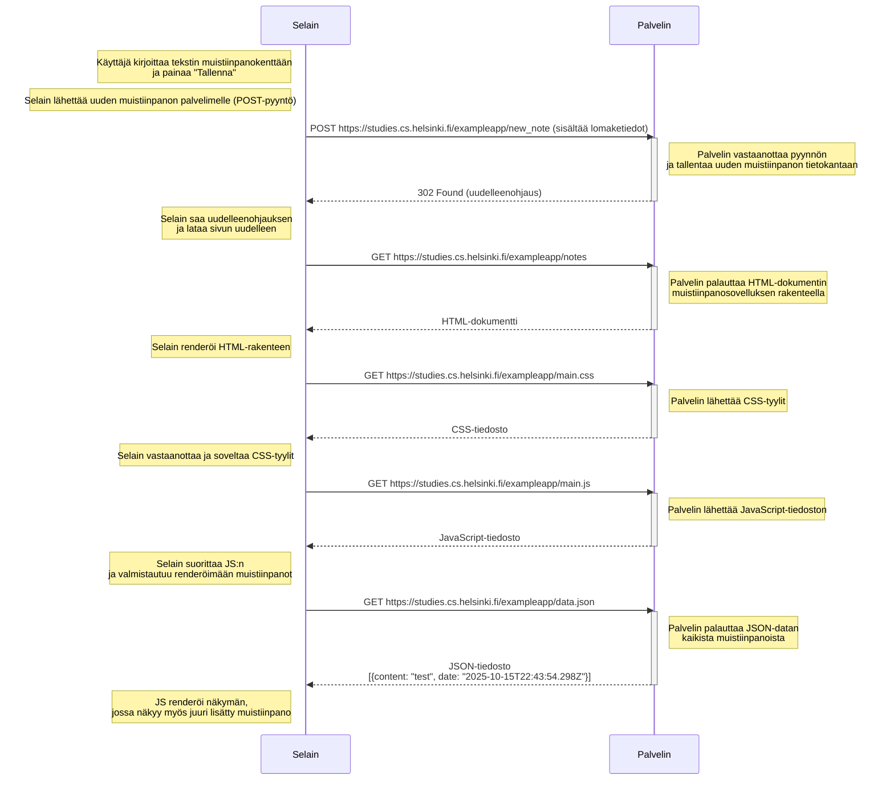

# 0.4: Uusi muistiinpano

```mermaid
sequenceDiagram
    participant Selain
    participant Palvelin

    Note left of Selain: Käyttäjä kirjoittaa tekstin muistiinpanokenttään<br/>ja painaa "Tallenna"

    Note left of Selain: Selain lähettää uuden muistiinpanon palvelimelle (POST-pyyntö)
    Selain->>Palvelin: POST https://studies.cs.helsinki.fi/exampleapp/new_note (sisältää lomaketiedot)
    activate Palvelin
    Note right of Palvelin: Palvelin vastaanottaa pyynnön<br/>ja tallentaa uuden muistiinpanon tietokantaan
    Palvelin-->>Selain: 302 Found (uudelleenohjaus)
    deactivate Palvelin

    Note left of Selain: Selain saa uudelleenohjauksen<br/>ja lataa sivun uudelleen

    Selain->>Palvelin: GET https://studies.cs.helsinki.fi/exampleapp/notes
    activate Palvelin
    Note right of Palvelin: Palvelin palauttaa HTML-dokumentin<br/>muistiinpanosovelluksen rakenteella
    Palvelin-->>Selain: HTML-dokumentti
    deactivate Palvelin
    Note left of Selain: Selain renderöi HTML-rakenteen

    Selain->>Palvelin: GET https://studies.cs.helsinki.fi/exampleapp/main.css
    activate Palvelin
    Note right of Palvelin: Palvelin lähettää CSS-tyylit
    Palvelin-->>Selain: CSS-tiedosto
    deactivate Palvelin
    Note left of Selain: Selain vastaanottaa ja soveltaa CSS-tyylit

    Selain->>Palvelin: GET https://studies.cs.helsinki.fi/exampleapp/main.js
    activate Palvelin
    Note right of Palvelin: Palvelin lähettää JavaScript-tiedoston
    Palvelin-->>Selain: JavaScript-tiedosto
    deactivate Palvelin
    Note left of Selain: Selain suorittaa JS:n<br/>ja valmistautuu renderöimään muistiinpanot

    Selain->>Palvelin: GET https://studies.cs.helsinki.fi/exampleapp/data.json
    activate Palvelin
    Note right of Palvelin: Palvelin palauttaa JSON-datan<br/>kaikista muistiinpanoista
    Palvelin-->>Selain: JSON-tiedosto<br/>[{content: "test", date: "2025-10-15T22:43:54.298Z"}]
    deactivate Palvelin

    Note left of Selain: JS renderöi näkymän,<br/>jossa näkyy myös juuri lisätty muistiinpano
```
