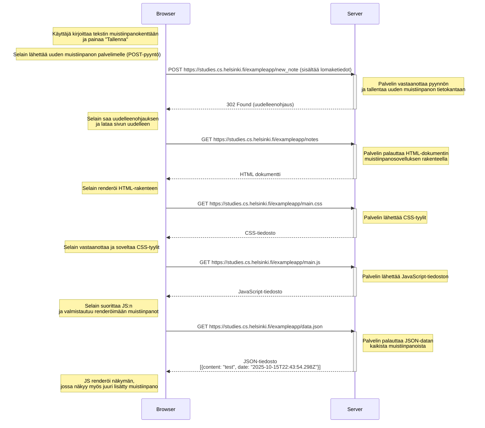

# 0.4: uusi muistiinpano

```mermaid
sequenceDiagram
    participant Browser
    participant Server

    Note left of Browser: Käyttäjä kirjoittaa tekstin muistiinpanokenttään<br/>ja painaa "Tallenna"

    Note left of Browser: Selain lähettää uuden muistiinpanon palvelimelle (POST-pyyntö)
    Browser->>Server: POST https://studies.cs.helsinki.fi/exampleapp/new_note (sisältää lomaketiedot)
    activate Server
    Note right of Server: Palvelin vastaanottaa pyynnön<br/>ja tallentaa uuden muistiinpanon tietokantaan
    Server-->>Browser: 302 Found (uudelleenohjaus)
    deactivate Server

    Note left of Browser: Selain saa uudelleenohjauksen<br/>ja lataa sivun uudelleen

    Browser->>Server: GET https://studies.cs.helsinki.fi/exampleapp/notes
    activate Server
    Note right of Server: Palvelin palauttaa HTML-dokumentin<br/>muistiinpanosovelluksen rakenteella
    Server-->>Browser: HTML dokumentti
    deactivate Server
    Note left of Browser: Selain renderöi HTML-rakenteen

    Browser->>Server: GET https://studies.cs.helsinki.fi/exampleapp/main.css
    activate Server
    Note right of Server: Palvelin lähettää CSS-tyylit
    Server-->>Browser: CSS-tiedosto
    deactivate Server
    Note left of Browser: Selain vastaanottaa ja soveltaa CSS-tyylit

    Browser->>Server: GET https://studies.cs.helsinki.fi/exampleapp/main.js
    activate Server
    Note right of Server: Palvelin lähettää JavaScript-tiedoston
    Server-->>Browser: JavaScript-tiedosto
    deactivate Server
    Note left of Browser: Selain suorittaa JS:n<br/>ja valmistautuu renderöimään muistiinpanot

    Browser->>Server: GET https://studies.cs.helsinki.fi/exampleapp/data.json
    activate Server
    Note right of Server: Palvelin palauttaa JSON-datan<br/>kaikista muistiinpanoista
    Server-->>Browser: JSON-tiedosto<br/>[{content: "test", date: "2025-10-15T22:43:54.298Z"}]
    deactivate Server

    Note left of Browser: JS renderöi näkymän,<br/>jossa näkyy myös juuri lisätty muistiinpano
```
