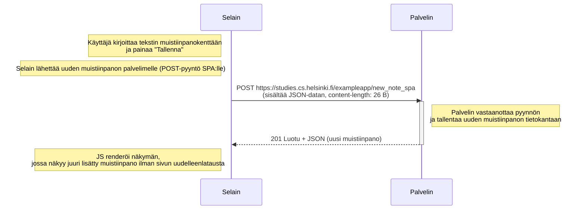

# 0.6: Uusi muistiinpano

```mermaid
sequenceDiagram
    participant Selain
    participant Palvelin

    Note left of Selain: Käyttäjä kirjoittaa tekstin muistiinpanokenttään<br/>ja painaa "Tallenna"

    Note left of Selain: Selain lähettää uuden muistiinpanon palvelimelle (POST-pyyntö SPA:lle)
    Selain->>Palvelin: POST https://studies.cs.helsinki.fi/exampleapp/new_note_spa<br/>(sisältää JSON-datan, content-length: 26 B)
    activate Palvelin
    Note right of Palvelin: Palvelin vastaanottaa pyynnön<br/>ja tallentaa uuden muistiinpanon tietokantaan
    Palvelin-->>Selain: 201 Luotu + JSON (uusi muistiinpano)
    deactivate Palvelin

    Note left of Selain: JS renderöi näkymän,<br/>jossa näkyy juuri lisätty muistiinpano ilman sivun uudelleenlatausta
```
